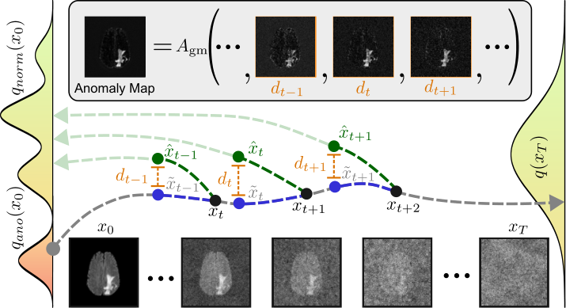

# ANDi

This repository contains the code for the [Unsupervised Anomaly Detection using Aggregated Normative Diffusion](https://arxiv.org/pdf/2312.01904.pdf) publication. Aggregated Normative Diffusion (ANDi) is made for detecting anomalies in brain MRI and is based on Denoising Diffusion Probabilistic Models. ANDi operates by aggregating differences between predicted denoising steps and ground truth backwards transitions. The model for ANDi has been trained on pyramidal Gaussian noise.

&nbsp;



First, we train a DDPM model using our proposed Gaussian pyramidal noise on healthy brain slices to approximate the normative distribution. In order to obtain an anomaly map for a possibly anomalous image, we first partially noise it using the Gaussian forward process (indicated by the gray arrow). We then calculate the pixel-wise Euclidean distance between the ground truth backwards transition and the denoising step for a partial range of t. The denoising step can be thought of as normative diffusion as it is taking one step
towards the normative distribution. Finally, using the geometric mean, we aggregate deviations over the time steps.

## File Structure

To use ANDi your data sets have to be in this format:

```
 ├── Dataset
    │   ├── subject_id 
    │   │   ├── subject_id_flair.nii.gz
    │   │   ├── subject_id_t1.nii.gz
    │   │   └── ...

```
Therefore you have one folder for each data set that contains all subject folders and every subject folder contains all files for one subject including the segmentation file. To specify the data splits multiple .csv files are needed that specify which subjects belong to train, test or validation split. Each .csv (one for train, test, val) is structured like this:

```
Subject_ID
Subject_1
Subject_2
...
```

## Preprocessing
For training, we use the slices of the BraTS21 data set that do not contain an anomaly according to their segmentation. The data set can be found on [Kaggle](https://www.kaggle.com/datasets/dschettler8845/brats-2021-task1). The volumes that belong to the specific splits that we used can be found in the [splits](splits) directory. For training, you need to generate the Lightning Memory-Mapped Database of the preprocessed slices with the [split_healthy.py](split_healthy.py) script.


```
python3 split_healthy.py -d ./data/BraTS21 -i ./splits/BraTS21/scans_train.csv -o ./data/BraTS21/healthy_slices_train.csv
```

## Training
The configuration for the training run can be set in the respective [config file](conf/train.yml). You need to specify the path to the created LMDB and the hyperparameters you want to use. Then the training can be started with:

```
accelerate launch train.py
```

## Evaluation
For the evaluation, we use the test data from BraTS21 and two data sets from the [Shifts Challenge 2022](https://shifts.grand-challenge.org/). To organize the Shifts data sets and to match the volumes from Shifts to BraTS the [prepare_data.py](prepare_data.py) script needs to be used multiple times and the [SRI Atlas](https://www.nitrc.org/projects/sri24) needs to be downloaded:

* First, generate a patient folder for every Shifts data set by only using the -d flag of the [prepare_data.py](prepare_data.py) script.
* Second, register the volumes in the patient folder with the -r flag and the -t flag to specify the template (T1_brain.nii).
* Third (Optional), use histogram matching with the -n flag and specify the source volume from BraTS21 (folder that contains all modality files) with the -i flag.

```
python3 prepare_data.py -d ./data/Shifts_MS/shifts_ms_pt1/shifts_ms_pt1/ljubljana
python3 prepare_data.py -d ./data/Shifts_MS/patients -r True -t ./data/BrainAtlas/sri24_spm8/templates/T1_brain.nii
python3 prepare_data.py -d ./data/Shifts_MS/patients -n True -i ./data/BraTS21/BraTS2021_00000
```

Then, run the evaluation with [eval.py](eval.py) and the respective [config file](conf/eval.yml):

```
accelerate launch eval.py
```


## Appendix

This code is based on @dome272 implementation of DDPM's https://github.com/dome272/Diffusion-Models-pytorch .
&nbsp;

All baseline implementations can be found in the [baselines folder](baselines)
