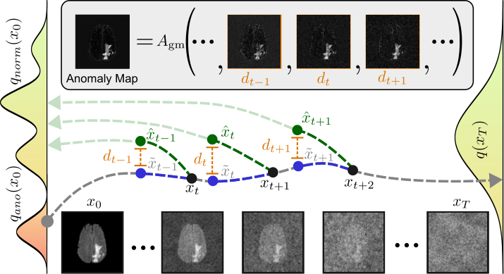

# ANDi

This repository contains the code for the [Unsupervised Anomaly Detection using Aggregated Normative Diffusion](https://arxiv.org/pdf/2312.01904.pdf) publication. Aggregated Normative Diffusion (ANDi) is made for detecting anomalies in brain MRI and is based on Denoising Diffusion Probabilistic Models. ANDi operates by aggregating differences between predicted denoising steps and ground truth backwards transitions. The model for ANDi has been trained on pyramidal Gaussian noise.

&nbsp;

First, we train a DDPM model using our proposed Gaussian pyramidal noise on healthy brain slices to approximate the normative distribution. In order to obtain an anomaly map for a possibly anomalous image, we first partially noise it using the Gaussian forward process (indicated by the gray arrow). We then calculate the pixel-wise Euclidean distance between the ground truth backwards transition and the denoising step for a partial range of t. The denoising step towards can be thought of as normative diffusion as it is taking one step
towards the normative distribution. Finally, using the geometric mean, we aggregate deviations over the time steps.

## Training
For training, we use the healthy slices of the BraTS21 data set. The data set can be found on [Kaggle](https://www.kaggle.com/datasets/dschettler8845/brats-2021-task1). The volumes that belong to the training data can be found in the [splits](splits) directory. For training, you can generate the data set of the healthy preprocessed slices with the [split_healthy.py](split_healthy.py) script, or you can decide to perform the preprocessing within the [train.py](train.py) script. The configuration for the training run can be set in the respective [config file](conf/train.yml).

## Evaluation
For the evaluation, we use the test data from BraTS21 and two data sets from the [Shifts Challenge 2022](https://shifts.grand-challenge.org/). To match the volumes from Shifts to BraTS the [prepare_data.py](prepare_data.py) script needs to be used multiple times and the [SRI Atlas](https://www.nitrc.org/projects/sri24) needs to be downloaded:

* First, generate a patient folder for every Shifts data set by just using the -d flag of the [prepare_data.py](prepare_data.py) script
* Second, register the volumes in the patient folder with the -r flag and the -t flag to specify the template (T1_brain.nii)
* Third (Optional), use histogram matching with the -n flag and specify the source volume from BraTS21 (folder that contains all modality files) with the -i flag

Then, run the evaluation with [eval.py](eval.py) and the respective [config file](conf/eval.yml).

## Appendix

This code is based on @dome272 implementation of DDPM's https://github.com/dome272/Diffusion-Models-pytorch .
&nbsp;

All baseline implementations can be found in the [baseline folder](baseline)
